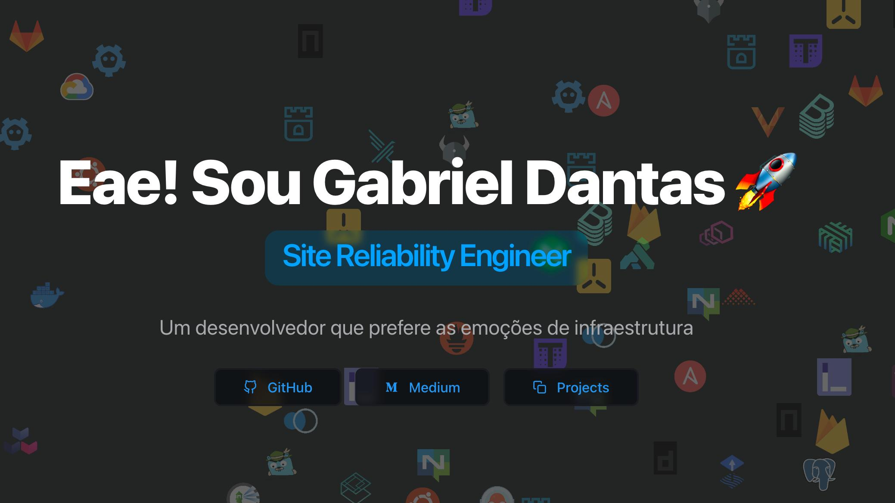

<div align="center">

<a target="_blank" href="https://gdantas.com.br">
    
</a>

[](https://gdantas.com.br)
[](https://github.com/tdemapp/website/blob/master/LICENSE)

</div>

## 🛠 Development

Clone the repository

```zsh
git clone https://github.com/gabriel-dantas98/gdantas.io.git
```

Install dependencies

```zsh
npm install

# Or using Yarn

yarn
```

Start the development server

```zsh
npm run dev

# Or using Yarn

yarn dev
```

Build for production

```zsh
npm run build

# Or using Yarn

yarn build
```

## 📄 License

MIT © [Ben Dixon](https://github.com/gabriel-dantas98/gdantas.io/blob/main/LICENSE)

## Credits

This project is inspired by [nuro.dev](https://github.com/NuroDev/nuro.dev)

## Presentations

Add entries to `data/presentations.json` to manage the `/presentations` page.

Each item supports:

-   `title` (string)
-   `description` (string)
-   `icon` (string, iconify id)
-   `color` (string, hex)
-   `url` (string, canonical link, optional; prefer `contentUrl`)
-   `contentUrl` (string, optional; link do conteúdo para o botão principal)
-   `githubUrl` (string, opcional; link do repositório)
-   `date` (string, optional)
-   `location` (string, optional)
-   `preview` (optional object):
    -   Google Slides:
        ```json
        {
        	"type": "google-slides",
        	"slidesEmbedUrl": "https://docs.google.com/presentation/.../embed?start=false&loop=false&delayms=3000"
        }
        ```
    -   YouTube:
        ```json
        { "type": "youtube", "youtubeId": "Y57gUwb1v3g" }
        ```
    -   GitHub README snippet (rendered with MDX styles):
        ```json
        { "type": "github-readme", "readmeMarkdown": "# Title\nSome markdown..." }
        ```

Notes:

-   We render README markdown at build time using `next-mdx-remote` with the same blog remark/rehype plugins.
-   If you want to fetch README from GitHub dynamically, wire a serverless API or fetch during `getStaticProps` with a token and put the markdown into `readmeMarkdown`.

## Internationalization (i18n)

This repo ships a minimal i18n layer without external deps:

- Locale files live in `locales/pt.json` and `locales/en.json`
- App is wrapped by `I18nProvider` (`~/lib/i18n`)
- Use the hook in components/pages:

```ts
import { useI18n } from '~/lib/i18n';

const { t, locale, setLocale } = useI18n();

return <h1>{t('home.title')}</h1>;
```

- The navbar settings menu includes a language switcher (PT/EN)
- Selected language is persisted in `localStorage` and sets `<html lang>` at runtime

Add/modify strings in the JSON files and reference by key. No routing changes are required and static export remains compatible.
